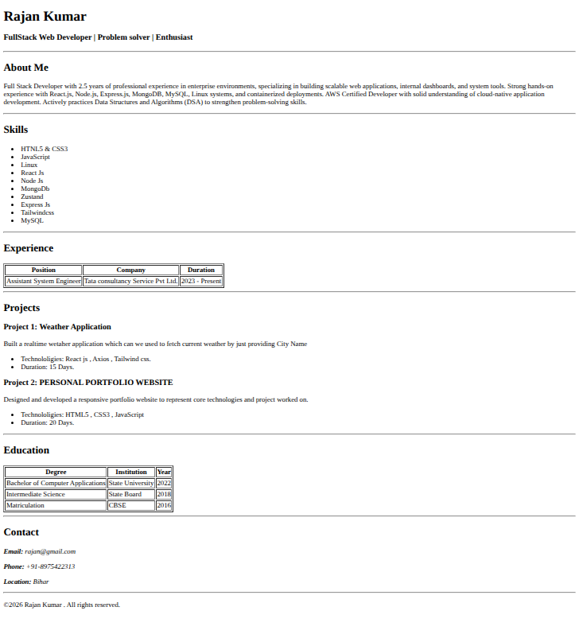

# Personal Portfolio Website (HTML)

## Project Overview

This project is a **basic personal portfolio website** built using **pure HTML5**.  
It showcases professional information such as personal details, skills, experience, projects, education, and contact information in a structured and semantic way.

The goal of this project is to demonstrate **strong HTML fundamentals**, proper document structure, and correct usage of HTML5 semantic elements.

---




##  Technologies Used

- **HTML5**

> No CSS or JavaScript is used in this version. The project focuses entirely on HTML structure and semantics.

---

##  Project Structure

```
.
├── index.html
└── README.md
```

- `index.html` – Main HTML file containing the complete portfolio content  
- `README.md` – Project documentation (this file)

---

## Features

- Semantic HTML5 structure
- Clear separation of content sections
- Easy to read and extend
- Beginner-friendly and recruiter-readable layout

---

##  Page Sections Explained

### Header
Displays the name and professional title.

### About Me
Professional summary highlighting experience and skills.

### Skills
Technical skills listed using unordered lists.

### Experience
Work experience presented in tabular format.

### Projects
Project descriptions with technologies used and duration.

### Education
Academic qualifications in a structured table.

### Contact
Email, phone number, and location using semantic tags.

### Footer
Copyright information.

---

##  Purpose of This Project

- Practice HTML5 fundamentals
- Learn semantic HTML elements
- Build a base for future styling and interactivity

---

##  How to Run

1. Download or clone the repository
2. Open `index.html` in any web browser

---

##  Future Enhancements

- Add CSS or Tailwind CSS
- Add JavaScript interactivity
- Deploy using GitHub Pages or Netlify

---

##  Author

**Rajan Kumar**  
Full Stack Web Developer  
Bihar, India  

---

##  License

## view image clicling below 


© 2026 Rajan Kumar. All rights reserved.
